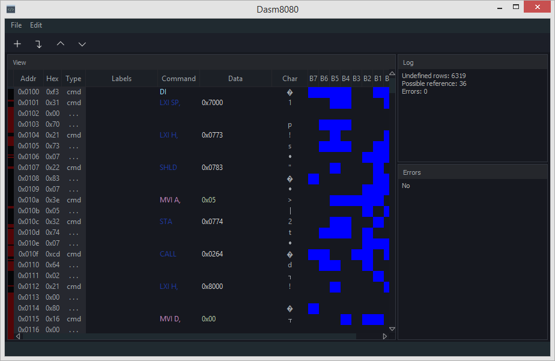
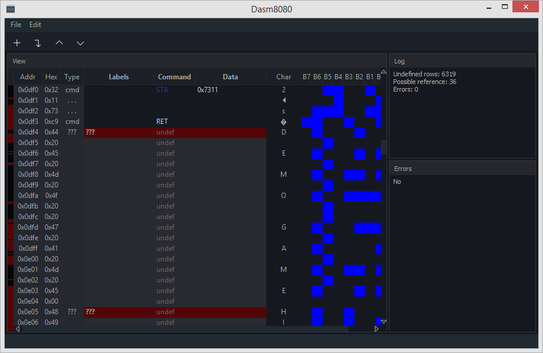
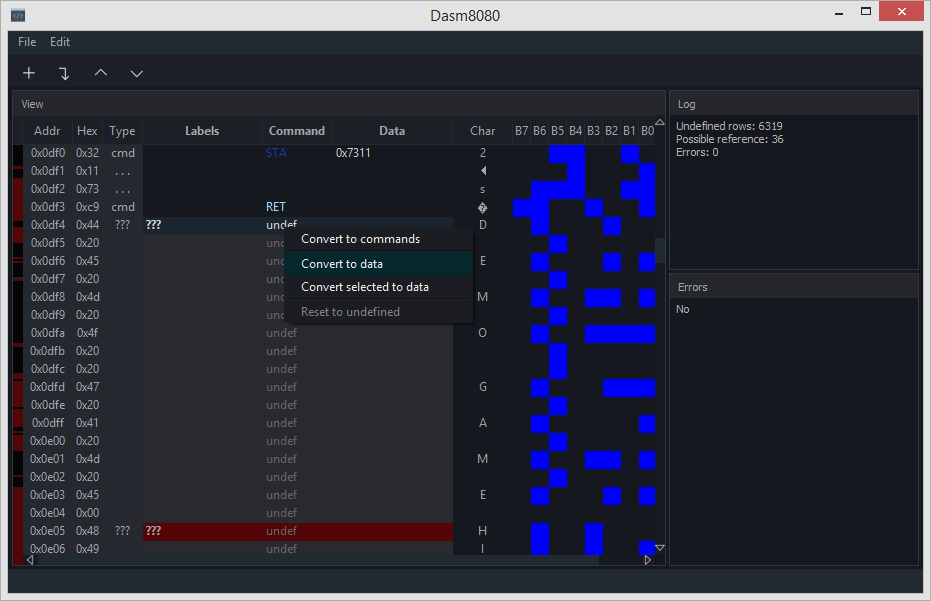
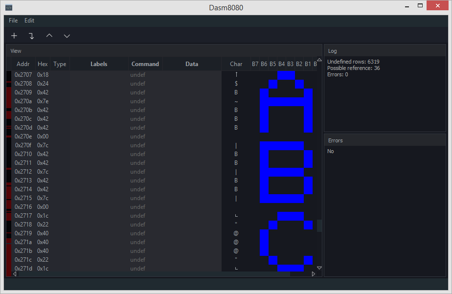
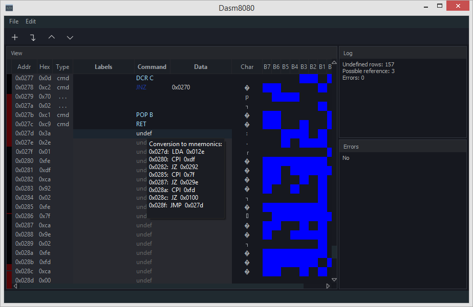

# Dasm8080

Dasm8080 it is a GUI tool for disassembling executable files for the intel 8080 microprocessor.
Disassembly of a binary file takes place in several stages:

Import a binary file, specifying the starting address. After importing, the program will try to automatically recognize commands and data. Recognition occurs according to the principle of "following the reference". The fields "Char" and "B7 - B0" will also be filled in, which correspond to the text and graphic representation of bytes.



The code that could not be recognized automatically can be recognized using additional methods of the program: first of all, look for the lines highlighted in red. It can be data or executable code (this figure shows that in this case it is data, thanks to the text representation of the code in the "Char" field).



To convert the entire block into data (or executable code), right-click on the "undef" field.



Similarly, you can recognize data using a graphical representation. This figure shows that the unrecognized code is the characters "A B C".



To recognize the executable code, use the popup hint when hovering over the "undef" field. The fields are displayed until the first encountered command "JMP" or "RET" or "PCHL", or if these commands are not in the specified block, then until the end of the block.




### Installation

Supported operating system: Linux x86_64, Windows 8.1/10 x86_64

##### - Debian 10.6 / Ubuntu 20.04 / Linux Mint 20:
  - install file dasm8080-(ver)_amd64.deb from [release](https://github.com/CineEncoder/dasm8080/releases)

*ver - current version

### Buid instructions
Install dependencies:

##### - Debian 10.6 / Ubuntu 20.04 / Linux Mint 20:
    - qt5-qmake>=5.11.3
    - qtbase5-dev>=5.11.3
    - qtmultimedia5-dev>=5.11.3

Buld package:

```sh
mkdir build
cd build
git clone https://github.com/CineEncoder/dasm8080.git
cd dasm8080
qmake-qt5 -o builddir/Makefile app/dasm8080.pro -spec linux-g++ CONFIG+=qtquickcompiler (or for Debian:  /usr/lib/qt5/bin/qmake -o builddir/Makefile app/dasm8080.pro -spec linux-g++)
cd builddir
make
```

### Licence

GNU GPL v.3
See [LICENSE.md](https://github.com/CineEncoder/Dasm8080/blob/master/LICENSE)

### Donate

If you wish to support this project, you can make a donation $0.5 or more via PayPal. Your contributions will help keep the project alive and support future development.

[](https://paypal.me/KozhukharenkoOleg?locale.x=ru_RU)

##### Bitcoin
You can send bitcoins at this address or by scanning the QR code below:


bc1ql0f3xpj57szcnn3gzr8cwajwxj880k8j4m22qv
